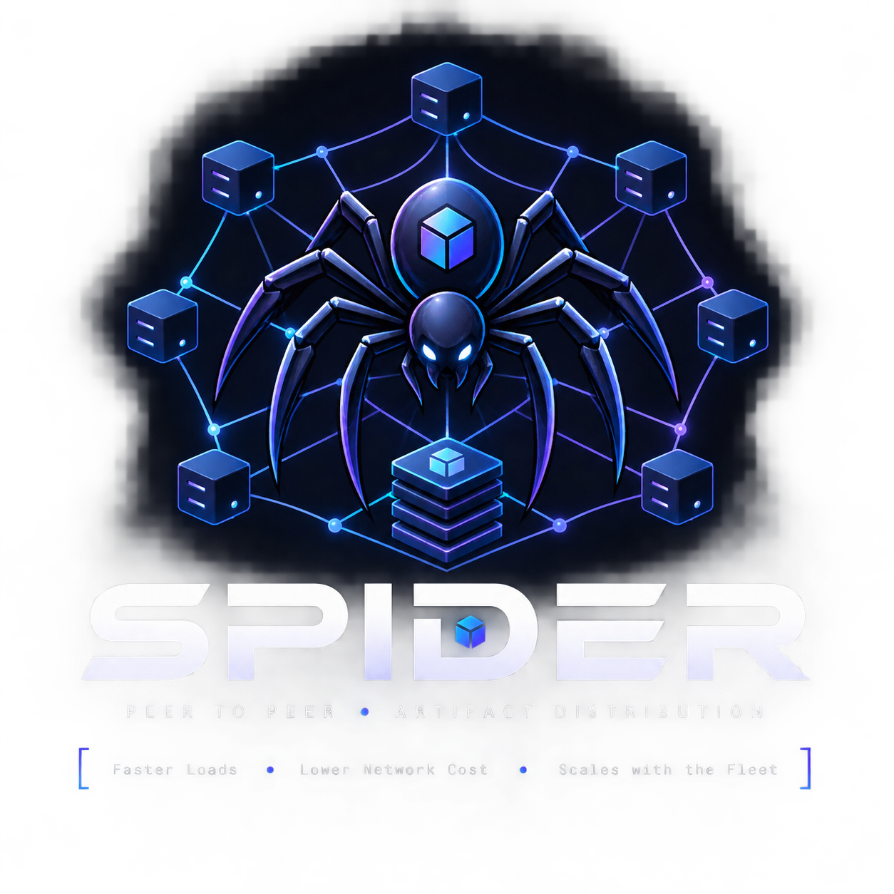
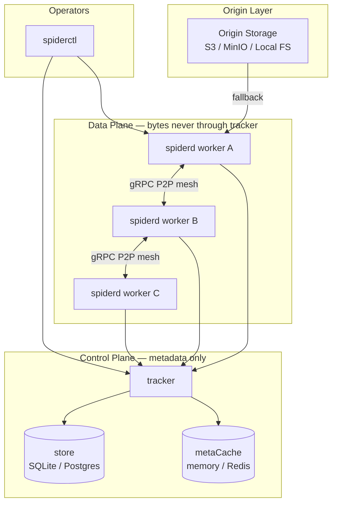

<p align="center">
  
</p>

# Spider: Distributed Artifact Fabric (DAF)

[](https://go.dev/)
[](LICENSE)
[](#architecture)
[](#project-status)

> **Project status:** Spider is in **early development** — **Phase 2 + 2.5 are complete**, but the project is **not production-ready**. APIs, config, and ops paths may change. Use for evaluation, benchmarking, and contribution only.

**Configuration & tuning:** **[docs/configuration.md](docs/configuration.md)** · **Architecture (detailed):** **[docs/architecture.md](docs/architecture.md)**

**Spider** is a high-throughput, content-addressed, topology-aware P2P distribution mesh designed to distribute massive immutable artifacts (LLM/ML models, datasets, binaries, containers, and directory trees) across large compute fleets while drastically reducing origin storage (S3/MinIO) network traffic.

---

## ⚡ Benchmarks (read before interpreting)

Latest recorded numbers and methodology: **[docs/benchmarks.md](docs/benchmarks.md)**.

| Mode | What it measures | Recorded on this host (2026-08-16) |
| :--- | :--- | :--- |
| Micro (Go `bench`) | Chunker, SHA-256, cache Put | 301–374 MB/s compute; ~25 MB/s atomic cache Put |
| In-process loopback | Engine regression, 500 MB × 6 workers | **100% origin saved**; ~0.40× wall clock vs direct origin |
| Compose fleet | Real `spiderd` + tracker + Grafana, 500 MB × 3 workers | **100% origin saved**; ~1.07× wall clock vs direct origin |

**Do not read wall-clock alone as “Spider is slower/faster.”** On a single machine (loopback or Podman on one host), origin is already a fast local bind mount — P2P adds gRPC, tracker, and verification overhead without cross-network savings. The primary metric is **origin-byte reduction** (`spider_origin_bytes_avoided_total` = peer + cache reuse; see `spider_origin_bytes_downloaded_total` vs `spider_peer_bytes_transferred_total`).

**Pending:** Multi-machine benchmark on a **real worker fleet** with a remote seed and origin (separate hosts or AZs). Same-host compose results are useful for correctness and Grafana demos, not for predicting production wall-clock speedup. See [docs/benchmarks.md](docs/benchmarks.md#limitations-of-the-current-testbed).

Grafana (after compose benchmark; on Podman Desktop for Windows use the [Podman VM IP](docs/benchmarks.md#grafana--prometheus), not always `localhost`): `/d/spider/spider-mesh` — `admin` / `admin`.

---

## System Architecture

Spider separates **control plane** (metadata only) from **data plane** (chunk bytes). The tracker never proxies artifact payload; workers stream directly peer-to-peer or from origin.



**Detailed diagrams** (sync lifecycle, component map, chunk data path, scheduler): **[docs/architecture.md](docs/architecture.md)**

### Configuration summary

Full reference: **[docs/configuration.md](docs/configuration.md)**

| Section | Key knobs | What it controls |
|---------|-----------|------------------|
| `store` / `metaCache` | `driver`, `dsn`, `redis.url` | Tracker durability and hot metadata cache |
| `chunkCache` | `dir`, `maxBytes`, `pinnedArtifacts` | On-disk chunk shards and LRU eviction |
| `download` | `maxConcurrency` | Parallel chunk fetch workers per sync |
| `origin` | `maxConcurrency` | Concurrent origin reads (fallback) |
| `upload` | `maxConcurrency`, `maxBandwidthMbps`, `maxQueueSize` | Outbound `GetChunk` limits; **Mbps is node-wide** |
| `peerClient` | `maxConnections`, `idleTimeout` | gRPC connection pool to peers |
| `advertisement` | `batchSize`, `interval`, `maxRetries` | Batched chunk registration with tracker retry |
| `peerDiscovery` | `refreshInterval` | Mid-sync tracker polling for peer locations |
| `retry` | `maxAttempts`, `backoff` | Per-chunk peer retry before origin |

```bash
# Both binaries read the same file
./bin/tracker  --config=spider.yaml
./bin/spiderd  --config=spider.yaml --node-id=worker-1 --tracker=127.0.0.1:50051
```

### Core Design Principles
1. **Artifact-First, Not Model-First**: Treats models, checkpoints, datasets, or software releases as arbitrary multi-file trees of immutable content-addressed chunks.
2. **Strict Control / Data Plane Separation**: Central Tracker only tracks metadata, locations, and topology. Data plane streams bytes directly peer-to-peer or from origin. Tracker **never proxies payload bytes**.
3. **Content Addressing & Verification**: Every chunk is addressed by cryptographic hash (`sha256:<hex>`). Chunks are atomically verified before committing to cache or advertising to the mesh.
4. **Topology-Aware Proximity**: Peering scheduler prefers candidate nodes ranked by network distance (`Host` > `Rack` > `Zone` > `Region` > `Remote`).
5. **Standalone Engine with Optional Orchestration**: Runs standalone on bare metal, containers, or VMs with zero external dependencies, while providing clean extension points for Kubernetes CRDs and operators.

See [docs/architecture.md](docs/architecture.md) for sync flow, component map, and layer reference.

---

## 📦 Repository Structure

```text
spider/
├── Containerfile                  # Slim runtime image (copies dist/linux/* only)
├── spider.yaml                    # Example daemon/tracker config
├── podman-compose.yml             # Local testbed: MinIO, tracker, Redis, 3 workers, Prometheus, Grafana
├── docker-compose.yml             # Docker-compatible testbed
├── deploy/                        # Compose config, Prometheus, Grafana provisioning
├── api/v1/                        # Manifest schema + tracker/peer protobuf
├── cmd/                           # tracker, spiderd, spiderctl
├── pkg/
│   ├── benchmark/                 # In-process fleet benchmark + payload helpers
│   ├── cache/                     # Chunk store + refcounted manager (LRU, pins)
│   ├── config/                    # YAML loader, SQL/Redis pool defaults
│   ├── engine/                    # Sync scheduler, peer fetch, origin fallback
│   ├── metacache/                 # Tracker metadata cache (memory / Redis)
│   ├── metrics/                   # Prometheus counters/histograms
│   ├── scheduler/                 # Peer rank, inflight, circuit breaker
│   ├── store/                     # Pluggable tracker backing store (SQLite, …)
│   └── …                          # chunk, materializer, peer, source, topology, verifier
└── scripts/
    ├── build-binaries.{sh,ps1}    # GOOS=linux cross-compile → dist/linux/
    ├── build-image.{sh,ps1}       # podman/docker build localhost/spider:local
    ├── run-compose-benchmark.*    # Fleet benchmark against compose stack + Grafana
    ├── run-benchmarks.*           # Micro + optional in-process + compose
    └── podman-poc-test.sh         # E2E validation experiments
```

---

## 🔒 Multi-Layer Data Integrity & Verification

Spider enforces end-to-end cryptographic integrity verification across 5 distinct layers to guarantee zero bit-rot, corruption rejection, and tamper-proofing:

1. **Wire Transfer Verification (`pkg/peer/client.go`)**:
   - Every 4 MiB chunk streamed over gRPC is cryptographically verified against its declared SHA-256 hash as bytes arrive over the network.
   - If a peer sends a single altered byte, the stream is rejected, the peer is marked degraded, and the engine automatically falls back to clean origin storage.
2. **Atomic Staging & Commit (`pkg/cache/cache.go`)**:
   - Chunks are downloaded to an isolated `tmp/` staging directory and `fsync`'d.
   - SHA-256 is re-computed from the **written on-disk bytes**. Only matching files are atomically renamed (`os.Rename`) into the shard store `chunks/sha256/xx/xxxx...`.
   - Corrupted or incomplete chunks are immediately purged from disk (`ErrHashMismatch`).
3. **Canonical Manifest Validation (`api/v1/manifest.go`)**:
   - Artifact identity is canonically computed as `sha256(canonical_manifest_json)`.
   - Every file's chunk offsets, lengths, and permissions must sum exactly to total file size. Tampered `artifactId` values are rejected.
4. **Materialize-Time Re-Hash (`pkg/materializer`)**:
   - Each cached chunk is hashed again while assembling the destination file tree. A bit-rotten cache entry aborts materialization and removes the partial file.
5. **Offline Bit-Rot Audit & Directory Verifier (`pkg/verifier`)**:
   - Audits materialized physical folders on disk against the canonical manifest (presence, size, per-chunk SHA-256).
   - Scans and detects bit-rot across local cache shards.

### Tests covering integrity:
- `pkg/cache`: hash mismatch on `PutChunk` / `PutChunkFromReader`, on-disk re-hash before rename.
- `pkg/peer`: corrupt gRPC payload rejected before cache commit.
- `pkg/engine`: corrupt peer recovery from origin; origin bytes that fail SHA-256 rejected.
- `pkg/materializer`: corrupt cache bytes cannot produce a destination file.
- `pkg/verifier`: valid audit, injected bit-rot, missing files, size mismatch.

### Verification CLI Commands:
```bash
# 1. Audit materialized folder on disk (validates all files, sizes, modes, and chunk SHA-256 hashes)
./bin/spiderctl verify artifact --manifest=manifest.json --dest=/models/llama-3-8b/1.0.0

# 2. Audit local chunk cache against silent disk corruption / bit-rot
./bin/spiderctl verify cache --cache-dir=/var/lib/spider
```

---

## 🚀 Quickstart

### Prerequisites
- Go 1.22+
- (Optional) Podman / Docker for containerized cluster simulation

### 1. Build Binaries

**Local (Windows/macOS/Linux):**
```bash
go build -o bin/tracker ./cmd/tracker
go build -o bin/spiderd ./cmd/spiderd
go build -o bin/spiderctl ./cmd/spiderctl
```

**Container image** (cross-compile on host, copy into slim Alpine image — no `go build` in the Containerfile):
```bash
./scripts/build-image.sh          # Linux/macOS
./scripts/build-image.ps1         # Windows
podman-compose -f podman-compose.yml up -d
```

**Compose fleet benchmark** (real tracker + workers + Grafana):
```bash
./scripts/run-compose-benchmark.sh
./scripts/run-compose-benchmark.ps1
```

### 2. Run Benchmarks
Run the built-in automated benchmark suite to compare Direct Origin vs. Spider P2P Mesh:
```bash
# Run 500 MB model across 6 worker nodes (payload: tmp/origin/payload.bin)
./bin/spiderctl benchmark --size=500 --workers=6 --chunk-size=4

# Use a different file or directory as the origin
./bin/spiderctl benchmark --file=/path/to/weights.bin --workers=6 --chunk-size=4

# Run Go engine microbenchmarks
go test -bench=Benchmark -benchmem ./pkg/chunk ./pkg/cache
```

### 3. Publishing, Syncing, and Verifying Artifacts

#### A. Start the Central Tracker
```bash
./bin/tracker --port=50051
```

#### B. Start Node Daemons (`spiderd`)
```bash
# Node 1 (Seeder)
./bin/spiderd --node-id=worker-1 --port=50052 --tracker=127.0.0.1:50051 --rack=rack-1 --zone=zone-a

# Node 2 (Peer)
./bin/spiderd --node-id=worker-2 --port=50053 --tracker=127.0.0.1:50051 --rack=rack-1 --zone=zone-a
```

#### C. Publish an Artifact (`spiderctl publish`)
```bash
./bin/spiderctl publish \
  --source=/path/to/model-weights \
  --name=llama-3-8b \
  --version=1.0.0 \
  --output=manifest.json \
  --tracker=127.0.0.1:50051
```

#### D. Sync Artifact across Mesh (`spiderctl sync`)
```bash
./bin/spiderctl sync \
  --manifest=manifest.json \
  --dest=/models/llama-3-8b/1.0.0 \
  --daemon=127.0.0.1:50053
```

#### E. Verify Data Integrity on Destination Disk (`spiderctl verify`)
```bash
./bin/spiderctl verify artifact \
  --manifest=manifest.json \
  --dest=/models/llama-3-8b/1.0.0
```

#### F. Query Status & Mesh Peers
```bash
./bin/spiderctl status --daemon=127.0.0.1:50053
./bin/spiderctl peers --tracker=127.0.0.1:50051
./bin/spiderctl cache --cache-dir=/var/lib/spider
./bin/spiderctl pin --manifest=manifest.json --cache-dir=/var/lib/spider
./bin/spiderctl unpin --artifact-id=sha256:... --cache-dir=/var/lib/spider
```

---

## 🐳 Containerized Multi-Node Testbed

MinIO origin, SQLite tracker with **Redis metadata cache**, Prometheus, Grafana, and 3 workers sharing one pre-built image.

```bash
./scripts/build-binaries.sh && ./scripts/build-image.sh
podman compose -f podman-compose.yml up -d
# or: ./scripts/run-compose-benchmark.sh   # benchmark + leave stack up for Grafana

# Grafana: http://<podman-vm-ip>:3000/d/spider/spider-mesh  (admin / admin)
# See docs/benchmarks.md if localhost does not forward on Windows.

./scripts/podman-poc-test.sh
```

Numbers and interpretation caveats: [docs/benchmarks.md](docs/benchmarks.md).

---

## 📋 Pending / known gaps

- [ ] **Multi-machine fleet benchmark** — workers and seed on separate hosts with remote S3/MinIO origin (current compose runs on one machine; wall-clock ≈ origin is expected).
- [ ] Phase 3: mTLS, signed manifests, RBAC
- [ ] Phase 4+: Kubernetes operator, multi-region scale, ML/GPU transports

---

## 🗺️ Roadmap & Phased Architecture

| Phase | Plan Document | Status | Focus |
|---|---|---|---|
| **Phase 1** | [`01-poc-and-podman`](docs/plans/phase-1-poc-and-podman-environment.md) | ✅ **Complete** | Core Go primitives, gRPC chunk streaming, tracker, atomic cache, CLI, and benchmark harness. |
| **Phase 2** | [`02-core-reliability`](docs/plans/phase-2-core-reliability-and-hardening.md) | ✅ **Complete** | Pluggable Store + metaCache, swarm scheduler, streaming chunk store, YAML config |
| **Phase 2.5** | [`configuration.md`](docs/configuration.md) | ✅ **Complete** | Node-wide upload bandwidth, EWMA throughput, stale peer reconciliation, ad retry, metrics, conn pool |
| **Phase 3** | [`03-security-auth`](docs/plans/phase-3-security-and-authorization.md) | 📋 Planned | Mutual TLS (mTLS), Ed25519 signed manifests, RBAC, path traversal policies |
| **Phase 4** | [`04-k8s-operator`](docs/plans/phase-4-kubernetes-operator-and-crds.md) | 📋 Planned | `ArtifactDeployment` CRD, Kubernetes Operator (`cmd/controller`), `spiderd` DaemonSet manifests. |
| **Phase 5** | [`05-scale-transports`](docs/plans/phase-5-multi-region-scale-and-transports.md) | 📋 Planned | Multi-region hierarchical control plane, zero-copy `splice` streaming, FastCDC chunking. |
| **Phase 6** | [`06-ml-gpu-extensions`](docs/plans/phase-6-ml-and-gpu-acceleration-extensions.md) | 📋 Planned | RDMA / GPUDirect Storage (GDS) transports, vLLM / HuggingFace runtime adapters. |

---

## 📄 License
MIT License. See [LICENSE](LICENSE) for details.

---

## Project status

Spider is **experimental software in active development**. It is suitable for local PoC, compose testbeds, and benchmarks — **not** for production artifact distribution without a full security, ops, and multi-node validation pass. Contributions and feedback welcome.