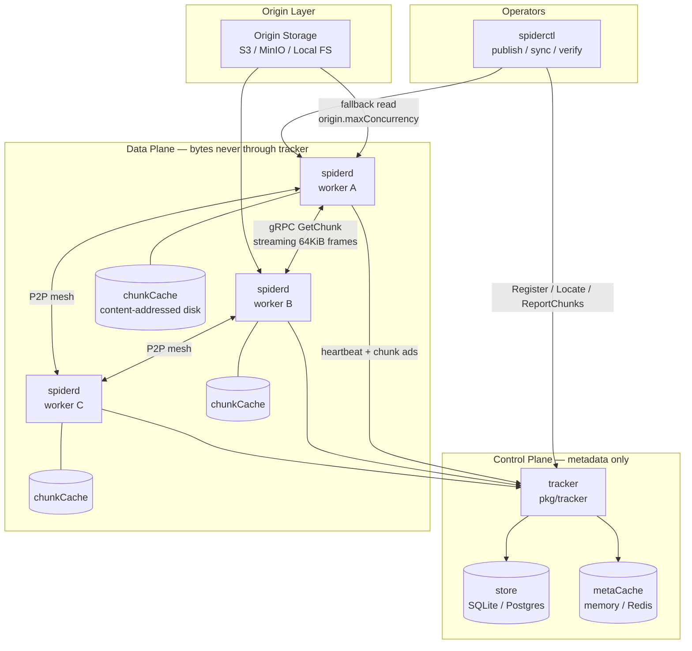
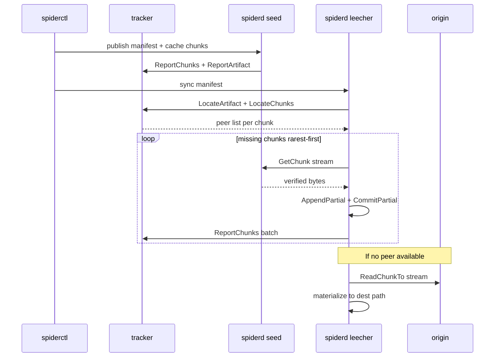
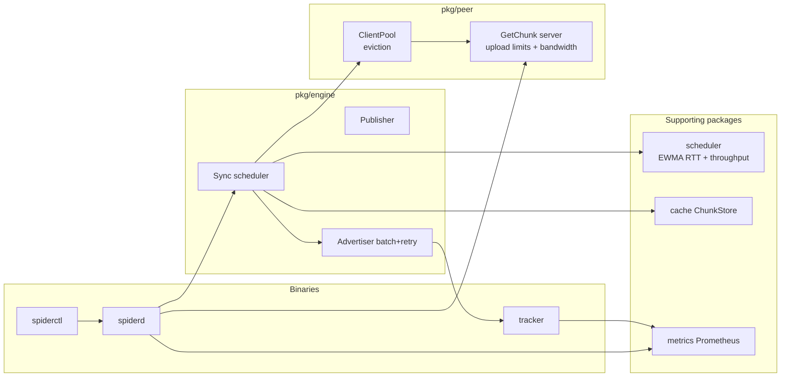
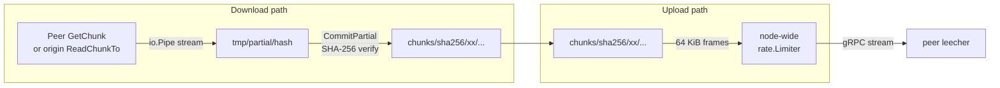
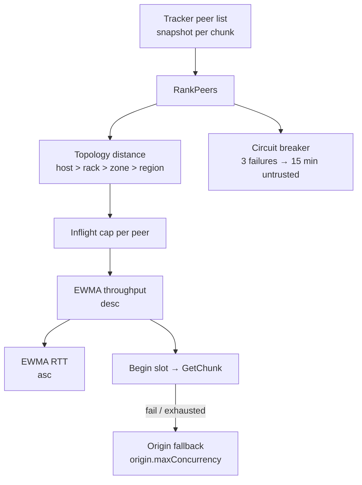

# Spider architecture

Spider is a content-addressed P2P artifact distribution mesh. This document describes how the components fit together, how data flows, and the design principles behind the implementation.

For YAML knobs and tuning, see **[configuration.md](configuration.md)**. For performance numbers, see **[benchmarks.md](benchmarks.md)**.

---

## Control plane vs data plane

The **tracker** (`cmd/tracker`) is the control plane: peer registry, artifact seeds, and sparse chunk location index. It never stores or proxies artifact bytes.

The **data plane** (`cmd/spiderd`) streams 4 MiB content-addressed chunks directly between workers over gRPC, with origin storage (S3 / MinIO / local FS) as a verified fallback.



---

## Sync lifecycle

A typical artifact distribution follows publish → locate → fetch → advertise → materialize.



### Engine sync phases

1. **Inventory** — Walk manifest; skip chunks already in local `chunkCache` (count as cache reuse).
2. **Discover** — `LocateArtifact` + `LocateChunks` from tracker; periodic refresh replaces stale peer lists mid-sync.
3. **Fetch** — Worker pool dequeues missing chunks **rarest-first** (dynamic reorder as discovery updates).
4. **Verify & persist** — Stream into partial files; incremental hash; atomic rename into `chunks/sha256/...`.
5. **Advertise** — Batched `ReportChunks` with retry/backoff (never before verify + commit).
6. **Materialize** — Assemble verified chunks into destination directory tree.

---

## Component map



---

## Chunk data path



---

## Scheduler and peer selection

When fetching a chunk, the engine ranks peers using signals from `pkg/scheduler`:



Work ordering across chunks uses **rarest-first**: chunks with the fewest known peers are fetched first, re-ranked on each dequeue as discovery refreshes.

---

## Layer reference (Phase 2 + 2.5)

| Layer | Package / binary | Role |
| :--- | :--- | :--- |
| **Config** | `pkg/config`, [`spider.yaml`](../spider.yaml), [configuration.md](configuration.md) | All knobs: store, caches, download/upload, ads, retries, peer client pool |
| **Tracker store** | `pkg/store` | Durable peers, artifact seeds, sparse chunk index (SQLite WAL default; Postgres via DSN) |
| **Tracker meta cache** | `pkg/metacache` | Optional Redis/memory/`none` fronting store reads |
| **Scheduler** | `pkg/scheduler` | Locality rank, EWMA RTT + throughput, rarest-first, inflight caps, circuit breaker |
| **Engine** | `pkg/engine` | Batched chunk ads with retry, live peer refresh + stale reconciliation, streaming ingest, origin fallback |
| **Chunk store** | `pkg/cache` (`ChunkStore`, `QuotaManager`) | Content-addressed files, resumable partials, refcounted LRU pins |
| **Peer transport** | `pkg/peer` | gRPC streaming, node-wide upload bandwidth (`golang.org/x/time/rate`), connection pool lifecycle |
| **Observability** | `pkg/metrics`, `pkg/httpserver` | Origin/peer/cache/swarm metrics; health/readiness on tracker and workers |
| **Build / deploy** | `scripts/build-binaries.*`, `Containerfile` | Cross-compile on host → slim Alpine runtime image (`localhost/spider:local`) |

### Tracker backends

Bring-your-own store and meta cache (YAML, flags, or `SPIDER_*` env). Combinations are independent:

```yaml
store:
  driver: postgres
  dsn: ${SPIDER_STORE_DSN}
metaCache:
  driver: redis
  redis:
    url: ${SPIDER_CACHE_REDIS_URL}
```

`cache:` / `diskCache:` remain valid aliases for `metaCache` / `chunkCache`. The tracker never stores artifact bytes — each `spiderd` keeps chunks on local disk.

S3/MinIO origin fallback on workers is enabled only when `S3_BUCKET` is explicitly set.

---

## Design principles

1. **Artifact-first** — Models, checkpoints, datasets, and release trees are arbitrary multi-file manifests of immutable content-addressed chunks.
2. **Control / data plane separation** — Tracker tracks metadata and topology only; bytes flow peer-to-peer or from origin.
3. **Content addressing & verification** — Every chunk is `sha256:<hex>`. Chunks are verified before cache commit and before advertisement.
4. **Topology-aware proximity** — Scheduler prefers `Host` > `Rack` > `Zone` > `Region` > remote.
5. **Standalone with extension points** — Runs on bare metal, VMs, or containers; clean hooks for future Kubernetes operator integration.

---

## Integrity layers

Spider verifies integrity at five points (see README for CLI commands):

| Layer | Location | What is checked |
|-------|----------|-----------------|
| Wire transfer | `pkg/peer/client` | Stream hash on complete download |
| Atomic commit | `pkg/cache` | On-disk re-hash before rename into shard store |
| Manifest | `api/v1` | Canonical artifact ID and chunk layout |
| Materialize | `pkg/materializer` | Per-chunk hash while assembling files |
| Offline audit | `pkg/verifier` | Directory tree vs manifest |

---

## Related docs

- [configuration.md](configuration.md) — YAML reference and tuning profiles
- [benchmarks.md](benchmarks.md) — performance methodology
- [plans/phase-2-core-reliability-and-hardening.md](plans/phase-2-core-reliability-and-hardening.md) — Phase 2 design notes
