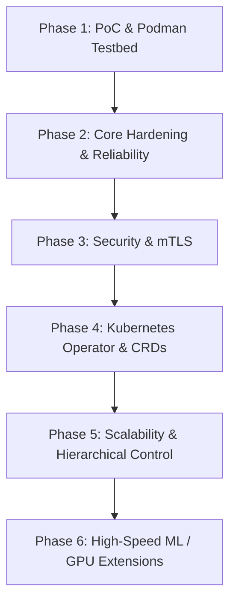

# Distributed Artifact Fabric — Master Phased Architecture Plan

**Version:** 1.2  
**Status:** Phase 1 complete; Phase 2 largely implemented — **project still early / not production-ready**  
**Product name:** **Spider**

This document is the master index for phase plans in `docs/plans/`.

---

## Executive Overview

**Spider** is a content-addressed, topology-aware P2P distribution mesh for massive immutable artifacts (ML models, datasets, binaries, directory trees). It cuts origin (S3/MinIO) traffic by serving verified chunks from nearby peers while always falling back to origin so jobs complete.

---

## vs alternatives

| System | Arena | Spider stance |
|---|---|---|
| Dragonfly / Spegel | OCI / k8s P2P CDN | Do not compete on images. Win on **artifact trees**, **integrity CLI**, **bare-metal/YAML** without CRDs. |
| IPFS | Public content network | Private fleet + **origin SLA**; tracker is the control plane. |
| BitTorrent | Swarm piece selection | Adopt rarest-first/load caps; add **rack topology** and origin fallback. |
| JuiceFS / Alluxio | POSIX cache filesystem | Different product: materialize a local tree, then apps use disk. |
| rsync + S3 / HuggingFace pull | Naive fan-out | **Version delta** (reused CAS chunks) + mesh offload. |

Do not market Redis, SQL, Prometheus, or YAML as differentiators.

**Phase 2 bets:** integrity-by-default; `sync` prints reused/peer/origin/saved; topology + origin without k8s; seed-based locate (not a row per chunk per node); `pinnedArtifacts` reconciled from YAML.

---

## Phase Roadmap Overview



| Phase | Plan Document | Core Focus | Key Deliverables |
|---|---|---|---|
| **Phase 1** | [phase-1-poc-and-podman-environment.md](phase-1-poc-and-podman-environment.md) | PoC Engine & Podman Testbed | Core Go packages, gRPC streaming, tracker, `spiderd`/`spiderctl`, 6 E2E experiments. **Complete.** |
| **Phase 2** | [phase-2-core-reliability-and-hardening.md](phase-2-core-reliability-and-hardening.md) | Reliability & Hardening | Pluggable Store+Cache (SQLite/Postgres + memory/Redis), compact seed ads, swarm scheduler, refcounted LRU + pins, Prometheus/`client_golang`, YAML. **Largely implemented; validation ongoing.** |
| **Phase 3** | [phase-3-security-and-authorization.md](phase-3-security-and-authorization.md) | Enterprise Security | mTLS, Ed25519 signed manifests, RBAC. Path-join guard is implemented in Phase 2; Phase 3 adds symlink policy and auth. |
| **Phase 4** | [phase-4-kubernetes-operator-and-crds.md](phase-4-kubernetes-operator-and-crds.md) | Kubernetes Integration | `ArtifactDeployment` CRD, controller, DaemonSet. |
| **Phase 5** | [phase-5-multi-region-scale-and-transports.md](phase-5-multi-region-scale-and-transports.md) | Scale & Advanced Transports | Regional federation, `splice`/sendfile, FastCDC. Compact seed ads ship in Phase 2. |
| **Phase 6** | [phase-6-ml-and-gpu-acceleration-extensions.md](phase-6-ml-and-gpu-acceleration-extensions.md) | ML & GPU | RDMA / GDS / NIXL, vLLM / HF adapters. |

---

## Core System Architecture

```text
External Source (S3/MinIO/FS)
          |
          v
   Artifact Manifest (JSON + SHA-256)
          |
          v
   Fixed/Variable Content Chunks (4 MiB)
          |
          v
  Content-Addressed Local Cache (/var/lib/spider/chunks)
          |
          +-----------------------+
          |                       |
          v                       v
 Distributed Peer Mesh     Materialized Directory Tree
   (gRPC Streaming)          (FS View for Apps)
```

Default materialization is **copy**; hardlink is optional when cache and dest share a filesystem.

---

## Primary Design Principles

1. **Artifact-First, Not Model-First**
2. **Strict Control / Data Plane Separation** — tracker never proxies payload bytes
3. **Reconciliation Over Imperative Commands** — `pinnedArtifacts` on the daemon; Kubernetes CRDs later
4. **Content Addressing & Verification**
5. **Kubernetes is Optional**
6. **Pluggable Store / Cache / Source** — drivers selected by config
7. **Local Testing Engine** — Podman Compose; see [docs/benchmarks.md](../benchmarks.md) for interpretation caveats (same-host runs measure origin savings, not production wall-clock).

**Benchmarks (2026-08-15):** Compose 500 MB × 3 workers — 100% origin bytes saved, ~0.96× wall clock on one machine. Multi-host fleet benchmark pending.

---

## Navigation & Phase Plans

- [Phase 1](phase-1-poc-and-podman-environment.md)
- [Phase 2](phase-2-core-reliability-and-hardening.md)
- [Phase 3](phase-3-security-and-authorization.md)
- [Phase 4](phase-4-kubernetes-operator-and-crds.md)
- [Phase 5](phase-5-multi-region-scale-and-transports.md)
- [Phase 6](phase-6-ml-and-gpu-acceleration-extensions.md)
