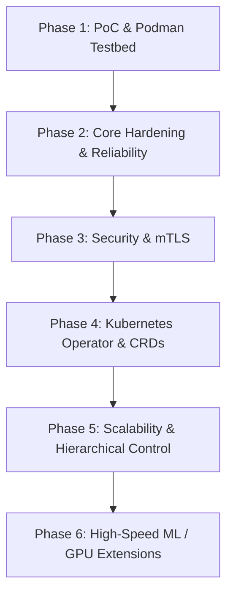

# Distributed Artifact Fabric — Master Phased Architecture Plan

**Version:** 1.0  
**Status:** Approved for Implementation  
**Root Spec Reference:** [`initial-spec.txt`](file:///d:/Projects/artifact-mesh/initial-spec.txt)

---

## Executive Overview

The **Distributed Artifact Fabric (Artifact Mesh)** is a content-addressed, topology-aware P2P distribution framework designed to distribute massive immutable artifacts (ML models, datasets, binary releases, directory trees) across large compute fleets while drastically reducing origin storage (S3/MinIO) network traffic.

This document serves as the master index for the phase-by-phase detailed implementation plans located in `docs/plans/`.

---

## Phase Roadmap Overview



| Phase | Plan Document | Core Focus | Key Deliverables |
|---|---|---|---|
| **Phase 1** | [`phase-1-poc-and-podman-environment.md`](file:///d:/Projects/artifact-mesh/docs/plans/phase-1-poc-and-podman-environment.md) | PoC Engine & Podman Testbed | Core Go packages, gRPC streaming engine, central tracker, `artifactd` daemon, `artifactctl` CLI, Podman Compose multi-node cluster, 6 E2E validation experiments. |
| **Phase 2** | [`phase-2-core-reliability-and-hardening.md`](file:///d:/Projects/artifact-mesh/docs/plans/phase-2-core-reliability-and-hardening.md) | Reliability & Hardening | Persistent SQLite/Postgres tracker DB, adaptive download scheduler, LRU cache eviction & pinning, Prometheus metrics (`origin_bytes_saved`). |
| **Phase 3** | [`phase-3-security-and-authorization.md`](file:///d:/Projects/artifact-mesh/docs/plans/phase-3-security-and-authorization.md) | Enterprise Security | Node mTLS, Ed25519 signed manifests, RBAC, path traversal & symlink security policy enforcement. |
| **Phase 4** | [`phase-4-kubernetes-operator-and-crds.md`](file:///d:/Projects/artifact-mesh/docs/plans/phase-4-kubernetes-operator-and-crds.md) | Kubernetes Integration | `ArtifactDeployment` CRD, Kubernetes Controller (`cmd/controller`), `artifactd` DaemonSet manifests, topology-aware node reconciliation. |
| **Phase 5** | [`phase-5-multi-region-scale-and-transports.md`](file:///d:/Projects/artifact-mesh/docs/plans/phase-5-multi-region-scale-and-transports.md) | Scale & Advanced Transports | Hierarchical/Regional control plane, zero-copy `splice` streaming, FastCDC content-defined variable chunking. |
| **Phase 6** | [`phase-6-ml-and-gpu-acceleration-extensions.md`](file:///d:/Projects/artifact-mesh/docs/plans/phase-6-ml-and-gpu-acceleration-extensions.md) | ML & GPU Transport Extensions | Pluggable RDMA / GPUDirect Storage (GDS) / NIXL transports, vLLM / HuggingFace runtime adapters, GPU architecture compatibility matching. |

---

## Core System Architecture

```text
External Source (S3/MinIO/FS)
          |
          v
   Artifact Manifest (JSON + SHA-256)
          |
          v
   Fixed/Variable Content Chunks (4 MiB)
          |
          v
  Content-Addressed Local Cache (/var/lib/artifactd/chunks)
          |
          +-----------------------+
          |                       |
          v                       v
 Distributed Peer Mesh     Materialized Directory Tree
   (gRPC Streaming)          (FS View for Apps)
```

---

## Primary Design Principles

1. **Artifact-First, Not Model-First**: The core distribution engine operates on arbitrary file trees and immutable byte chunks without coupling to specific ML frameworks or tensor formats.
2. **Strict Control / Data Plane Separation**: Control plane (Tracker/Registry) manages metadata and peer locations; data plane streams bytes directly between workers or origin storage. Control plane **never proxies payload bytes**.
3. **Reconciliation Over Imperative Commands**: Declarative desired state (`artifact X@v2 must exist on target nodes`). Workers independently reconcile toward state.
4. **Content Addressing & Verification**: Every chunk is addressed by cryptographic hash (SHA-256). Bytes are verified on the wire, re-hashed from durable cache files before commit, re-hashed again during materialization, and can be audited offline via `pkg/verifier` / `spiderctl verify`.
5. **Kubernetes is Optional**: The core engine (`artifactd`, `tracker`, `artifactctl`) runs standalone anywhere (bare metal, containers, VM). Kubernetes operator is an integration layer on top.
6. **Local Testing Engine**: Local environment uses **Podman** containers (`podman-compose`) to simulate multi-node topologies, origin storage (MinIO), and failure scenarios.

---

## Navigation & Phase Plans

- [Phase 1: Proof-of-Concept & Podman Environment Plan](file:///d:/Projects/spider/docs/plans/phase-1-poc-and-podman-environment.md)
- [Phase 2: Core Reliability & Framework Hardening Plan](file:///d:/Projects/spider/docs/plans/phase-2-core-reliability-and-hardening.md)
- [Phase 3: Security & Enterprise Authorization Plan](file:///d:/Projects/spider/docs/plans/phase-3-security-and-authorization.md)
- [Phase 4: Kubernetes Operator & CRD Plan](file:///d:/Projects/spider/docs/plans/phase-4-kubernetes-operator-and-crds.md)
- [Phase 5: Multi-Region Scale & Advanced Transports Plan](file:///d:/Projects/spider/docs/plans/phase-5-multi-region-scale-and-transports.md)
- [Phase 6: High-Speed ML & GPU Acceleration Extensions Plan](file:///d:/Projects/spider/docs/plans/phase-6-ml-and-gpu-acceleration-extensions.md)
