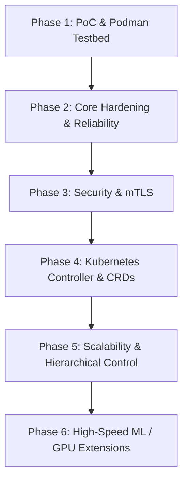

# Distributed Artifact Fabric — Implementation Plan & Phase Refinement

This document outlines the refined, multi-phase technical roadmap for the **Distributed Artifact Fabric (Artifact Mesh)**, based on `initial-spec.txt`. It places primary emphasis on **Phase 1 (Proof of Concept)** to set up a clean, scalable Go codebase and local **Podman** containerized environment, enabling seamless transition into subsequent production phases.

---

## 1. Phased System Roadmap



### **Phase 1: Proof-of-Concept (PoC) & Local Podman Environment** *(Current Focus)*
* **Goal**: Validate core content-addressed P2P distribution, origin bandwidth reduction, verification, and crash resilience without external dependencies like Kubernetes.
* **Tech Stack**: Go 1.22+, gRPC / Protocol Buffers, AWS SDK v2 / MinIO Go SDK, Podman & Podman Compose.
* **Deliverables**:
  1. `pkg/chunk`: Fixed 4 MiB chunker with SHA-256 content addressing.
  2. `pkg/cache`: Disk-backed content-addressed store (`/var/lib/artifactd/chunks/...`) with atomic writes (`tmp` -> rename).
  3. `pkg/materializer`: Reconstructs original physical directory tree/files from verified chunk cache.
  4. `pkg/source`: Extensible storage adapter interface with Local Filesystem and S3/MinIO drivers.
  5. `cmd/tracker`: Centralized gRPC service for peer heartbeats, chunk locations, and topology ranking.
  6. `cmd/artifactd`: Node daemon handling local REST/gRPC API, P2P gRPC streaming transfers (`GetChunk`), transfer scheduling, and crash resume.
  7. `cmd/artifactctl`: Publisher and management CLI (`publish`, `inspect`, `sync`, `status`, `peers`, `cache`).
  8. `deploy/podman`: Podman Compose configuration and setup scripts simulating MinIO seed storage, central tracker, and 3+ worker nodes across simulated racks/zones.

### **Phase 2: Framework Hardening & Core Reliability**
* Persistent Metadata DB for Tracker (PostgreSQL / SQLite WAL mode).
* Advanced Download Scheduler: Peer bandwidth throttling, dynamic peer ranking based on measured latency/throughput, exponential backoff retries.
* Cache Eviction & Garbage Collection: LRU eviction, disk quota management, artifact pinning.
* Comprehensive Observability: Prometheus metrics (`origin_bytes_saved`, `peer_bytes_transferred`, sync durations) and structured JSON logging.

### **Phase 3: Enterprise Security & Auth**
* mTLS for all gRPC communication (daemon-to-daemon, daemon-to-tracker).
* Signed Manifests using Ed25519 asymmetric signatures.
* Node identity verification, authorization checks, and path-traversal / symlink safety policies.

### **Phase 4: Kubernetes Integration & Operator**
* `ArtifactDeployment` CRD specification and Status subresource updates.
* Kubernetes Controller / Operator (`cmd/controller`) implementing reconciliation loop.
* `artifactd` DaemonSet manifests and Helm chart with Kubernetes node topology affinity (`topology.kubernetes.io/zone`).

### **Phase 5: Multi-Region Scale & Advanced Transports**
* Hierarchical control plane (Global Registry + Regional Trackers) for cross-datacenter scale.
* Zero-copy I/O streaming optimizations.
* Variable/Content-Defined Chunking (CDC via Rabin fingerprints) for fine-grained delta distribution.

### **Phase 6: ML & GPU Acceleration Extensions**
* Pluggable transport architecture supporting RDMA, GPUDirect Storage (GDS), and NIXL.
* ML framework runtime adapters (vLLM / HuggingFace cache preloader).
* Hardware compatibility metadata matching (CUDA compute capabilities, GPU arch).

---

## 2. Phase 1 (PoC) Detailed Architecture & Implementation

### 2.1 Repository Structure
```text
artifact-mesh/
├── Containerfile                  # Multi-stage Containerfile for Go binaries
├── podman-compose.yml             # Podman topology orchestration
├── go.mod
├── go.sum
├── initial-spec.txt
├── api/
│   └── v1/
│       ├── manifest.go            # Manifest JSON schema & validation
│       └── proto/
│           ├── tracker.proto      # Central tracker gRPC protocol
│           └── peer.proto         # Daemon-to-daemon chunk streaming protocol
├── cmd/
│   ├── artifactctl/               # Publisher & operator CLI
│   ├── artifactd/                 # Local node daemon
│   └── tracker/                   # Central tracker service
├── pkg/
│   ├── chunk/                     # Chunker & hash calculator
│   ├── cache/                     # Content-addressed chunk cache
│   ├── materializer/              # File tree builder from chunks
│   ├── source/                    # Storage adapters (FS, S3/MinIO)
│   ├── tracker/                   # Tracker registry & peer database
│   ├── peer/                      # gRPC stream chunk server & client
│   ├── engine/                    # Concurrent download scheduler & fallback engine
│   └── topology/                  # Topology ranking (Host > Rack > Zone > Region)
└── scripts/
    ├── generate-test-data.sh      # Script to generate synthetic multi-file test artifacts
    └── podman-poc-test.sh         # E2E automated test runner for Podman benchmark scenarios
```

### 2.2 Core Data Schemas

#### Manifest (`api/v1/manifest.go`)
```json
{
  "schemaVersion": 1,
  "artifactId": "sha256:e3b0c44298fc1c149afbf4c8996fb92427ae41e4649b934ca495991b7852b855",
  "name": "gpt-x",
  "version": "2.0",
  "chunkSize": 4194304,
  "totalSize": 10737418240,
  "files": [
    {
      "path": "config.json",
      "size": 8192,
      "mode": "0644",
      "chunks": [
        { "hash": "sha256:111...", "offset": 0, "size": 8192 }
      ]
    },
    {
      "path": "model.safetensors",
      "size": 10737410048,
      "mode": "0644",
      "chunks": [
        { "hash": "sha256:222...", "offset": 0, "size": 4194304 },
        { "hash": "sha256:333...", "offset": 4194304, "size": 4194304 }
      ]
    }
  ]
}
```

#### Protobuf Protocols (`api/v1/proto/`)
* **`tracker.proto`**:
  - `RegisterPeer(PeerInfo)`
  - `Heartbeat(HeartbeatRequest)`
  - `ReportChunks(ChunkReport)`
  - `LocateChunks(LocateRequest) returns (LocateResponse)`
* **`peer.proto`**:
  - `GetChunk(ChunkRequest) returns (stream ChunkResponse)` (streams 64 KiB buffer chunks for a requested 4 MiB SHA-256 chunk)

### 2.3 Podman Environment & Verification Suite

The PoC environment will be managed using **Podman** containers on a custom network `artifact-net`.

```text
               +-------------------------------------------+
               |            Podman Network: artifact-net    |
               |                                           |
               |   +---------------+   +---------------+   |
               |   | MinIO (S3)    |   | Central       |   |
               |   | port: 9000    |   | Tracker       |   |
               |   +-------+-------+   +-------+-------+   |
               |           |                   |           |
               |   +-------+-------------------+-------+   |
               |   |               |                   |   |
               |   v               v                   v   |
               | +-----------+   +-----------+   +-----------+ |
               | | worker-1  |   | worker-2  |   | worker-3  | |
               | | (Seed A)  |   | (Peer B)  |   | (Peer C)  | |
               | +-----------+   +-----------+   +-----------+ |
               +-------------------------------------------+
```

#### Automated Experiment Battery (`scripts/podman-poc-test.sh`)
1. **Experiment 1 (Baseline MinIO Download)**: 3 workers fetch 1 GB artifact concurrently strictly from MinIO. Record origin bandwidth and completion time.
2. **Experiment 2 (P2P Mesh Download)**: Worker 1 syncs from MinIO; Workers 2 & 3 sync from Worker 1 and MinIO concurrently. Verify `origin_bytes_saved >= 60%`.
3. **Experiment 3 (Peer Failure Resilience)**: Kill Worker 1 midway through Worker 2's sync; verify Worker 2 seamlessly falls back to MinIO or other available peers without failure.
4. **Experiment 4 (Crash & Resume)**: Abort Worker 2 at 50% download; restart daemon; verify resume without re-downloading previously verified chunks.
5. **Experiment 5 (Chunk Integrity Verification)**: Inject corrupted byte into a peer's chunk stream; verify receiving `artifactd` rejects chunk, logs error, and refetches from standard origin/peer.
6. **Experiment 6 (Deduplication across Versions)**: Publish Artifact v1 and Artifact v2 (80% identical chunks); verify Worker 3 only transfers 20% new chunks for v2.

---

## 3. User Review Required

> [!IMPORTANT]
> **Container Runtime**: We are standardizing on **Podman** and `podman-compose` for local multi-node cluster simulation and integration testing as requested.

> [!NOTE]
> **Implementation Order**: We follow the strict guidelines of initial spec §53 by building core Go primitives (Chunker -> Cache -> Source Adapters -> Single Node Sync -> Peer Streaming -> Tracker -> P2P Engine) before introducing any Kubernetes components.

---

## 4. Open Questions

> [!IMPORTANT]
> **1. Chunk Materialization Strategy**: For local file tree materialization from the chunk store, should we default to **file copying** or **hardlinking**? Hardlinks save disk space and provide zero-copy instantiation when `/var/lib/artifactd` is on the same filesystem.

> [!NOTE]
> **2. MinIO S3 Credentials**: For automated Podman local testing, is hardcoding standard dev credentials (`minioadmin` / `minioadmin`) in `podman-compose.yml` acceptable?

> [!NOTE]
> **3. Protobuf Code Generator**: Should we use `protoc` with `protoc-gen-go` / `protoc-gen-go-grpc` or standard `buf` to generate Go gRPC stubs in `api/v1/proto`?

---

## 5. Verification Plan

### Automated Tests
- `go test ./pkg/... -v`: Unit tests for chunker, cache, manifest parsing, topology scoring, and source adapters.
- `./scripts/podman-poc-test.sh`: Full end-to-end Podman multi-container benchmark execution verifying P2P speedup, crash resume, chunk corruption handling, and origin bandwidth reduction.

### Manual Verification
- CLI test using `artifactctl publish` -> `artifactctl sync` -> `artifactctl status` across Podman containers.
